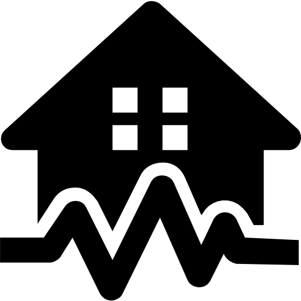

## www.geoforecast.xyz 

This is an app to support www.geoforecast.xyz 
Look at the [Nuxt 3 documentation](https://nuxt.com/docs/getting-started/introduction) to learn more.


### Quick Start 

Prerequisites:
 - node 20.9.0 (for example by: nvm use v20.9.0)
 - latest yarn 

Install sources:
```bash
yarn install --prefer-offline --pure-lockfile --non-interactive --production=false
```

Run dev:
```bash
yarn dev
```

It runs a `watch and reload` app on 3000 port


### Production build from sources 

When running `yarn build` with the Node server preset, the result will be an entry point that launches a ready-to-run Node server.

```bash
node .output/server/index.mjs
```

This will launch your production Nuxt server that listens on port 3000 by default.
It respects the following runtime environment variables:
- NITRO_PORT or PORT (defaults to 3000)
- NITRO_HOST or HOST (defaults to '0.0.0.0')
- NITRO_SSL_CERT and NITRO_SSL_KEY - if both are present, this will launch the server in HTTPS mode. In the vast majority of cases, this should not be used other than for testing, and the Nitro server should be run behind a reverse proxy like nginx or Cloudflare which terminates SSL.


Check out the [deployment documentation](https://nuxt.com/docs/getting-started/deployment) for more information.


## Env variables 

App requires several environment variables to be app and running.

- SECONDARY_KEY - Azure access key, **not default** 


## Build docker 

Build is done based on docker [multi stage](https://docs.docker.com/build/building/multi-stage/) build.   
To build a production ready optimized image just run:

```bash
docker build -t ${TAG_NAME} .
```
